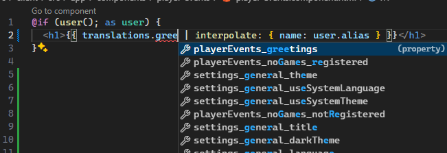

[](https://www.npmjs.com/package/@ngneers/signal-translate)
[](https://github.com/NGneers/signal-translate/actions/workflows/build.yml)
[](https://bundlephobia.com/package/@ngneers/signal-translate)

# signal-translate

Provides an easy way to provide translations in the form of signals in an Angular application.

## Motivation 💥

Signals are a powerful way to provide state in an Angular application.
They are a great way to provide translations as well.
Unfortunately, traditional translation libraries are not designed to work with signals and instead rely on Observables.
Also these libraries typically do not provide type safety for translations.

## Features 🔥

✅ Easy to setup and use

✅ Type safe translations

✅ ESM & CJS exports

This library provides a way to easily provide translations in the form of signals.

## Built With 🔧

- [TypeScript](https://www.typescriptlang.org/)

## Usage Example 🚀

```ts
import { Injectable, inject, signal } from '@angular/core';
import { BaseTranslateService, InterpolatePipe, interpolate } from '@ngneers/signal-translate';

import type translations from './en.json';

@Injectable({ providedIn: 'root' })
export class TranslateService extends BaseTranslateService<
  // Provide the type of the translations object for one language
  typeof translations
> {
  constructor() {
    super(
      // Provide the available languages
      ['en', 'de'],
      // Provide the initial language (if null the browser language (navigator.language) is used)
      'en'
    );
  }

  protected loadTranslations(lang: string): Promise<typeof translations> {
    // Load the translations for the given language
    switch (lang) {
      case 'en':
        return import('./en.json').then(x => x.default);
      case 'de':
        return import('./de.json').then(x => x.default);
      default:
        // Only languages that are in the available languages array are passed
        // so this should never happen
        throw new Error(`Language ${lang} is not supported`);
    }
  }
}

// Usage
@Component({
  selector: 'app-root',
  standalone: true,
  imports: [InterpolatePipe],
  template: `
    <!-- Just call the signal for the wanted translation. -->
    <h1>{{ translations.hello() }}</h1>

    <!--
      You can also pass parameters to the signal to interpolate translations
      `{{ name }}` in the translation will be replaced with the value of the name property
    -->
    <h2>{{ translations.greetings({ name: 'John' }) }}</h2>

    <!-- You can also use the interpolate pipe to interpolate strings -->
    <h2>{{ "Hello {{name}}!" | interpolate: { name: 'John' } }}</h2>

    <!--
      You can access translations unsafely with an unspecified string using the _unsafe property.
      This is useful for translations that are not known at compile time.
    -->
    <h2>{{ translations._unsafe["status_" + status()]() }}</h2>

    <button (click)="setLanguage('de')">Change language to german</button>
  `,
})
export class AppComponent {
  private readonly _translateService = inject(TranslateService);

  // Retrieve the translations signal
  protected readonly translations = _translateService.translations;

  protected readonly status = signal<string>('vip');

  public setLanguage(lang: string): void {
    // Set the language
    this._translateService.setLanguage(lang);
  }

  public greet(): void {
    // You can interpolate translations by passing the values as the argument
    // `{{ name }}` in the translation will be replaced with the value of the name property
    alert(this.translations.greetings({ name: 'John' }));

    // You can also interpolate strings using the interpolate function
    alert(interpolate("Hello {{name}}!", { name: 'John' }));
  }
}
```

## Strongly typed translations 📚

The IDE will provide autocompletion for the translations.


## Contributing 🧑🏻‍💻

Contributions are what make the open source community such an amazing place to learn, inspire, and create. Any contributions you make are **greatly appreciated**.

If you have a suggestion that would make this better, please fork the repo and create a pull request. You can also simply open an issue with the tag "enhancement".
Don't forget to give the project a star! Thanks again!

1. Fork the Project
2. Create your Feature Branch (`git checkout -b feature/AmazingFeature`)
3. Commit your Changes (`git commit -m 'Add some AmazingFeature'`)
4. Push to the Branch (`git push origin feature/AmazingFeature`)
5. Open a Pull Request

## License 🔑

Distributed under the MIT License. See `LICENSE.txt` for more information.
